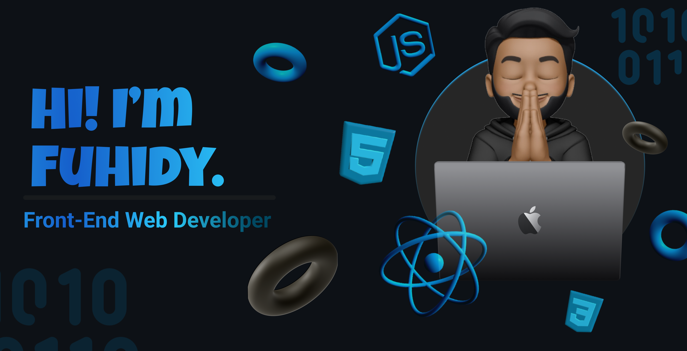

  

<!-- ## 🌐 Socials -->

 
 

 

<h1 align="left">Hello World 💫👋🏽 ..!</h1>

<!-- #  About Me -->

I am a front-end developer from Yemen who is passionate about learning new things every day. I enjoy drinking tea, coffee, watching anime, movies, and series, and listening to music. I am currently enrolled in Microverse, a coding bootcamp that is helping me to become a better developer.  I am always looking for new challenges and opportunities to learn and grow. I am confident that my passion for learning and my dedication to my craft will make me a valuable asset to any team.  If you are looking for a talented and motivated front-end developer, please do not hesitate to contact me.

 

# 🛠️ Tech Stack

           

<!-- # 📊 GitHub Stats:

 

 

 -->

<!-- ### ✍️ Random Dev Quote

 -->

---

<!-- Proudly created with GPRM ( https://gprm.itsvg.in ) -->
